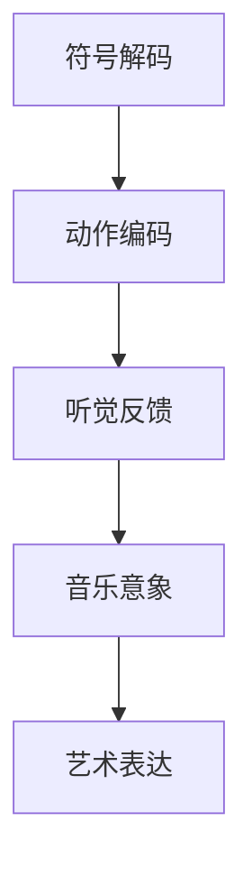

# 你真的了解钢琴吗

### 钢琴学习的艺术维度与技术解析

## 钢琴：音乐的引路人

钢琴作为音乐体系的重要分支，承载着技术传承与艺术启蒙的双重使命。视野聚焦现代社会，不少音乐爱好者的音乐之旅都是从钢琴开始。本文将从声学原理、创作技法、学习实践三个维度展开系统论述，探索钢琴的深层规律。其次作为乐器之王，钢琴以其丰富的音色和表现力，吸引着无数人投身于它的学习之中。钢琴教学不仅是技术的传授，更是艺术的传承和心灵的启迪。文中我们将探讨钢琴的多个方面，包括钢琴的音色特点、旋律写作以及学习中注意事项等。

---

## 钢琴声学系统的多维解析

### 音色形成的物理机制

- **弦列共振原理**：低音区铜丝缠绕弦与高音区裸钢弦的物理差异（低音弦质量密度比达 1:300）
- **共鸣板声学响应**：云杉木纹走向对高频泛波的传导特性（最佳年轮密度为 2-4 条/厘米）
- **制音器动力学**：延音踏板介入时的谐波叠加规律（平均增加 37%泛音列能量）

### 音区表现的时空演变

#### 低音区（A0-C3）表情图谱

- **历史语境中的角色转变**：
  - 巴洛克时期：通奏低音的功能支撑（平均律钢琴曲集 BWV846）
  - 浪漫主义时期：戏剧性叙事载体（拉赫玛尼诺夫《第二钢琴协奏曲》第 1 乐章）
  - 现代音乐：空间声效发生器（梅西安《鸟鸣集》中的微分音处理）

#### 高音区（C6-C8）美学功能

- **泛音列控制技术**：
  - 触键角度与泛音比例关系（45° 触键比垂直触键减少 23%高频泛波）
  - 延音踏板分段使用法（半踏板技术可保留特定频段泛音）
  - 现代作品特殊技法：指甲刮弦、琴槌直接击弦

---

## 钢琴语法的创作学体系

### 旋律构造的拓扑结构

#### 线性维度发展技术

1. **主题内核的裂变法则**：

   - 节奏细胞解构（贝多芬《热情奏鸣曲》动机发展）
   - 音程空间拓展（斯克里亚宾《第五奏鸣曲》神秘和弦运用）
   - 调式色彩渐变（德彪西《前奏曲》全音阶渗透）

2. **装饰体系的历时性演变**：
   - 巴洛克装饰音规范（巴赫装饰音符号对照表）
   - 古典时期装饰逻辑（莫扎特 K.331 变奏曲的语法规则）
   - 印象派装饰革命（拉威尔《水之嬉戏》中的波浪音型）

### 和声织体的空间叙事

#### 垂直结构控制技术

- **声部密度梯度**：
  | 密度层级 | 适用场景 | 代表作品 |
  |---|---|--|
  | 单声部线性 | 主题呈示 | 肖邦《夜曲》Op.9 No.2 |
  | 三声部对位 | 复调发展 | 巴赫《平均律》C 大调前奏曲 |
  | 八度叠加 | 高潮推进 | 李斯特《匈牙利狂想曲》No.2 |

#### 横向运动张力模型

- **能量积累公式**：
  `E = ∫(动态变化率 × 音区跨度 × 节奏密度)dt`
  - 柴可夫斯基《四季》中"十一月"的暴风雪模拟
  - 普罗科菲耶夫《第七奏鸣曲》战争场面的机械节奏

---

## 钢琴教学的现代性重构

### 技术训练的三维模型

1. **生理协调系统**：

   - 重力传导训练（借鉴 Taubman Approach 的旋转原理）
   - 肌肉记忆构建（慢练速度阈值为原速的 40%-60%）
   - 神经反射优化（针对三对二节奏的脑电同步训练）

2. **认知发展阶梯**：

---

## 跨学科视域下的钢琴

### 音乐声学的最新研究成果

- **琴弦振动数学模型**：
  `∂²u/∂t² = c²(∂²u/∂x²) - ε(∂u/∂t) + F(x,t)`
  - 包含阻尼项和非线性激励项的改进波动方程
  - 斯坦威 D-274 三角琴的有限元模态分析

---

## 钢琴的音色特点

钢琴不同音区在不同力度下能展现出丰富多样的音色特点，这些特点为音乐表达提供了广阔的空间。

### 低音区

- **中/低力度**：阴暗、沉郁，如肖邦前奏曲雨滴 1min40s 后一点的低音旋律，能营造出深沉的氛围
- **大力度**：严肃、宏大或者阴森、抑郁。在伴奏中，低音区大力度演奏常用于高潮段落；单独出现时，多见于前奏、尾奏等部分。

### 高音区

- **中/低力度**：空灵、恬淡、柔和，例如德彪西《月光》，肖邦的各类夜曲等，给人宁静、悠远的感觉。
- **大力度**：辉煌，适合表现史诗感、深沉的抒情。如《肖邦第一叙事曲》的高潮段(5min)，使用了高音区、大力度、和弦化的钢琴旋律，极具代表性。

---

## 钢琴旋律的写作

### 旋律的类型

- **歌唱性旋律**：对于钢琴而言，平均一般八分音符以上就能算是歌唱性的旋律。其长音旋律可按不同力度和音区的音色特点分类。
  - **低音区弱力度**：柔和、深沉，与中音区中弱力度有类似的支持感和温暖感。
  - **中音区中/弱力度**：如肖邦的《离别》，有温暖的抒情感；如巴赫的复调音乐，有端庄、理性之感。
  - **低/中音区大力度**：有强烈的压迫感或庄严感，参考肖邦《第二叙事曲》2min20s 左右的部分。当低音线条作主旋律时，曲子会有很强的宿命感、肃穆感，如肖邦练习曲《冬风》。
  - **高音区大力度**：辉煌、史诗、深情，如肖邦《第一叙事曲》高潮段(5min 左右)。这类歌唱性旋律的演奏有多种装饰方法，根据演奏法可分为长触键与短触键。长触键适合抒情，可参考肖邦练习曲《离别》；短触键更加灵动，可参考莫扎特《土耳其进行曲》。
- **装饰音旋律和非装饰音旋律**：在不同场合，人们对旋律装饰程度的喜好不同。古典时期的旋律装饰程度一般较少，浪漫主义时期则往往较多。

### 典型的短音旋律型

- **填充短音符的长音旋律**：在一个典型的长音旋律基础上填充大量短音符，既能保留长音旋律的歌唱性，又能体现短音的灵动感，还具有华彩感、炫技感。如李斯特《匈牙利狂想曲》5min20s 处和《钟》的处理。
- **向上大跳 + 快速下行**：在浪漫主义的钢琴独奏曲中常见，可参考李斯特超凡练习曲第九首 50s 左右。实现这种快速上下行有琶音、自然音阶、半音阶三种方案，选择时需考虑下行总音程，自然音阶更端庄，半音阶更俏皮。
- **跨音区上下行**：以固定节奏型快速模进的方式出现，在浪漫主义时期常用于情绪激昂的段落，可作为段落推进或终止的要素。
- **半音阶上下行**：同样常作为段落推进或终止的要素。

---

## 钢琴教学的要点

### 注重基础

在教学初期，要扎实掌握基本的乐理知识、指法和弹奏姿势。正确的指法和姿势是后续学习的基础，能避免不必要的错误和伤害。

### 培养乐感

通过欣赏优秀的钢琴作品，引导自己感受音乐的情感、节奏和韵律。学会用音乐表达自己的情感，而不仅仅是机械地弹奏音符。

---

## 总结

钢琴是一项充满挑战和乐趣的工作。通过了解钢琴的音色特点和旋律写作方法，以及掌握钢琴练习技巧，可以更好地走进钢琴的世界。无论是对于专业的音乐学习者还是业余爱好者，钢琴都能为我们带来无尽的艺术享受和心灵滋养。
在技术革命与艺术创新的双重驱动下，钢琴正经历着从实体向虚拟，从线下到线上的转变。我们不单将从传统钢琴的学习入手，同时也可以让个人智慧与前沿科技有机结合，培养具备完整音乐兴趣与音乐技巧。人工智能辅助的个性化学习、虚拟钢琴的出现都将吸引更多音乐爱好者学习钢琴。
